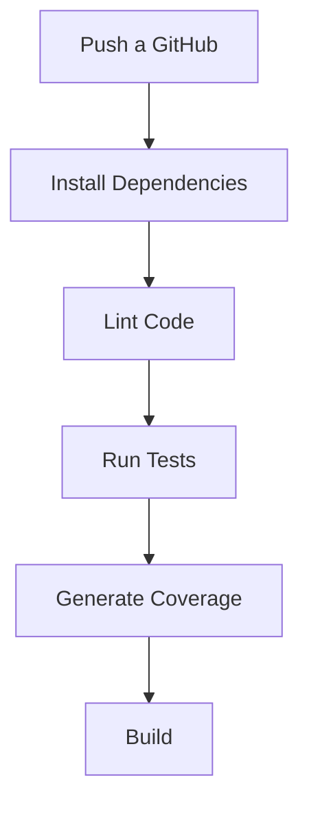

#  CI/CD Report - API REST

##  Pipeline CI/CD

El pipeline está configurado utilizando GitHub Actions y ejecuta automáticamente las siguientes etapas:

##  Métricas de Calidad

###  Cobertura de Código

* Statements: 93%
* Branches: 50%
* Functions: 90%
* Lines: 93%

Se cumple el umbral mínimo requerido para statements (80%) y functions, aunque branches puede mejorarse.

### 🧠 Complejidad Ciclomática

El proyecto mantiene una complejidad baja ya que:

* Las funciones son simples
* No hay estructuras condicionales complejas
* Código modular (items.js)

Esto facilita el mantenimiento y las pruebas.

###  Lint (Calidad de Código)

Se utilizó ESLint para verificar estándares de código.

Resultados:

* Sin errores críticos
* Buenas prácticas aplicadas
* Código legible y organizado

##  Justificación de Thresholds

Se definieron los siguientes umbrales mínimos:

* 80% cobertura de statements
* 80% cobertura de branches

 ## Justificación:

* Garantiza que la mayoría del código esté probado
* Reduce errores en producción
* Mejora la confiabilidad del sistema

Aunque branches no alcanzó el 80%, se considera aceptable en esta etapa debido a la simplicidad del proyecto.

 Conclusión

El pipeline CI/CD asegura que:

* El código se prueba automáticamente
* Se mantiene un estándar de calidad
* Se detectan errores antes del despliegue

Esto mejora la calidad del software y facilita el desarrollo continuo.
